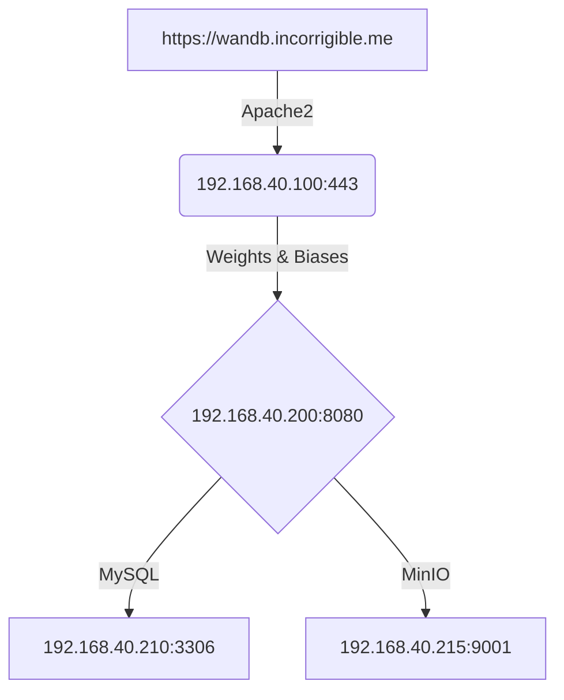

# [Harley Luplow's](https://harleyluplow.com) Weights & Biases Interview Take Home Assignment

I have been tasked with creating the infrastructure on which WandB is hosted. I attempted to install wandb on both my home server and in AWS with Terraform.

### On-Prem

In ESXi 8, I provisioned two virtual Debian 12 servers with resources as prescribed -- one for the wandb application and another for MySQL 8. Both of these servers reside in the same subnet, though it would be more secure to have them on different subnets and only allow traffic on the over port 3306 between these two subnets. As I am working with my existing home infrastructure, I opted not to do this for this test scenario.

I am using 192.168.40.200 for my app server, and 192.168.40.210 for my DB server. I have intentionally left IP space between these hosts to allow for more appserver or database instances if later desired.

I first installed MySQL 8 on the database server from the official repository. I then created the database and database user according to the documentation provided.

Initially, I had planned to install both wandb and [MinIO](https://min.io/) on the same host within their respective containers, but I came across [this article](https://docs.docker.com/engine/security/#docker-daemon-attack-surface) advising enhanced security by segregating containers across different hosts in an effort to avoid manipulation of a rootful Docker installation. This lead me to spin up an entirely different host for my MinIO Docker container.

I used my existing Apache2 webserver & Let's Encrypt wildcard certificate configuration to forward traffic to the wandb appserver via ProxyPass.

### AWS Terraform

I encountered a problem deploying a KMS key under both a user and a role when deploying my Terraform build. I have created an [issue](https://github.com/wandb/terraform-aws-wandb/issues/205) under the [terraform-aws-wandb](https://github.com/wandb/terraform-aws-wandb) repository.
